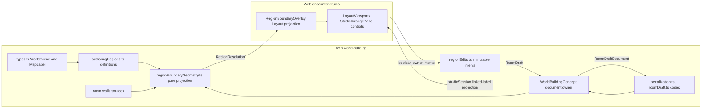

# Encounter Studio authoring regions

## What this is

[Web #1245](https://github.com/KirkDiggler/rpg-dnd5e-web/issues/1245) and the
[design law](design.md) describe a scene-owned area definition linked to a room
label. It reuses authored wall sources, map-label anchors, workspace cells and
the canonical Studio document/history. It introduces no second gameplay region,
floor owner, visibility authority or saved derived polygon. This walkthrough covers the definition, geometry, owner and Layout seams.
Provider carriage and gameplay behavior are separate contracts.

## Component shape

## Ownership and contracts

| Component                                                       | Owns                                                                 | Input → output                                                                                                                        |
| --------------------------------------------------------------- | -------------------------------------------------------------------- | ------------------------------------------------------------------------------------------------------------------------------------- |
| `types.ts`                                                      | `WorldScene.version`, optional definitions; `MapLabel.text/location` | Scene3 → `AuthoringRegion[]` linked by `labelId`                                                                                      |
| `authoringRegions.ts`                                           | Definition grammar and copy-only witness comparison                  | Unknown intent + `MapLabel[]` + optional workspace/reserved IDs → validated `AuthoringRegion[]`; `EnclosureWitness` → comparison copy |
| `serialization.ts`, `roomDraft.ts`, `workspaceContentBounds.ts` | Persisted shape/size and protected workspace content                 | `RoomDraftDocument` → validated document / JSON; invalid data → refusal                                                               |
| `regionBoundaryPredicates.ts`                                   | Certified geometric classifications                                  | Authored X/Z inputs → certified relation or uncertainty                                                                               |
| `regionBoundaryGeometry.ts`                                     | Transient face and conflict resolution                               | `Readonly<RoomDraft>` → `RegionResolution[]`; draft + `WorldPoint` → certified ring/witness or unresolved reason                      |
| `regionEdits.ts`                                                | Immutable explicit boundary intents                                  | Draft + create/bind/paint/pair-delete arguments → `RoomDraft` or refusal; equal intent → original reference                           |
| `WorldBuildingConcept.tsx` with region intents                  | Canonical document/history and intent fences                         | Region intent → boolean acceptance and one document transaction                                                                       |
| `studioSession.ts` with optional linked-label projection        | Read-only owner seam                                                 | Existing `{kind:'label',id}` selection → optional region/resolution and owner intents                                                 |
| `RegionBoundaryOverlay.tsx` and Layout/Arrange controls         | Visible boundary, unresolved explanation, initiating gesture         | Projections → Layout display; explicit gesture → owner intent                                                                         |

The definition validator does not look up faces or prune missing wall references.
The codec does not bind witnesses, upgrade scenes on load or relax policy gates.
The predicate/geometry pair does not weld nearby endpoints or persist a ring.
The immutable intent layer does not mutate floor, props, bindings or scope.
The owner does not acquire boundaries during render or wall commits.
The Studio seam does not own a second document or selected-region store.
The Layout renderer does not make game rules or visibility claims.

## Walk one thing through

A kitchen room label is a `MapLabel` named `kitchen-label` with anchor `{x:2,z:1}`.
The explicit create-room-label intent pairs it with region `kitchen-region`.
For walls A `(0,0)→(4,0)`, B `(4,0)→(2,4)`, C `(2,4)→(0,0)`, certified
acquisition produces the CCW `EnclosureWitness` `[A+,B+,C+]`. Here `+` means the
actual `BoundaryRun.direction: 'start-to-end'`, not a saved coordinate.

The owner accepts a single `RoomDraftDocument` with scene3. The codec carries
that oriented source word and the label link; it adds no polygon. pure
resolution derives a `RegionResolution` with `area.kind:'polygon'` for Layout.
The region identity survives every hop; the ring is derived and disposable.

Moving the apex to `(2,5)` can preserve that word while changing the derived
ring. Moving the label outside it yields an explanation, not a replacement
witness. If creation cannot certify an enclosure, the saved automatic boundary
has no witness. Closing walls later does not bind it; the author pays one
explicit **Use enclosing walls** action (R3). This is the difference between
repairing accepted intent and adopting a new area silently.

## Separations that look like one thing

| Query                                            | Source of truth                                                        |
| ------------------------------------------------ | ---------------------------------------------------------------------- |
| What is this area called, and where is its seed? | Linked `MapLabel.text/location`                                        |
| Which enclosure did the author accept?           | `AuthoringRegion.boundary.witness.walk`                                |
| What area is currently supported?                | Pure `RegionResolution`, never serialized                              |
| Which cells have floor?                          | `room.walkableHexes`, independent of explicit region cells             |
| Which gameplay region or visibility facts apply? | Provider-owned gameplay data, not scene authoring metadata             |
| Is the saved document structurally/policy valid? | Existing strict codec gates, separate from geometric unresolved status |

**An unbound definition is not a request to infer on render.** Combining intent
and projection would silently adopt a larger face after a divider disappears.
Combining floor and explicit cells would turn region repair into destructive
terrain editing. Combining unresolved status and policy validity would allow
invalid policies through an existing strict gate (R4).

## Trade-offs

| Decision                    | Benefit                                                     | Cost / boundary                                           | Not taken                            |
| --------------------------- | ----------------------------------------------------------- | --------------------------------------------------------- | ------------------------------------ |
| Oriented source walk        | Tracks boundary identity without a second polygon           | Author may need rebind after source endpoint reversal     | Unordered source set / saved polygon |
| Explicit-only acquisition   | Reload/render cannot change author intent                   | Author binds an initially open enclosure once it closes   | Effect-driven witness adoption       |
| Conservative certificates   | Renderer receives honest unresolved explanations            | Geometry owner refuses uncertified angled/multiway cases  | Arbitrary epsilon welding            |
| Scene3 opt-in               | Codec leaves old notes/scenes alone                         | Old readers reject new metadata version                   | Silent upgrade / downgrade           |
| Shared document transaction | History restores label/boundary and unrelated data together | Owner must enforce all stale-context fences               | Separate region store                |
| No conflict winner          | Author retains both definitions                             | Author must repair overlap/duplicate-room-label conflicts | Priority or cell theft               |

## Edges

A ring is planar X/Z authoring geometry, not a navigation mesh. Full wall spans
include openings regardless of door state (R2). Exact axis-collinear overlaps
are geometric coverage, not a reason to snap or rewrite source endpoints (R10).
The graph splits their union at actual endpoints/junctions, retains each span's
covering sources, and validates the raw simple face before selecting provenance.
For an overlapping maximal straight face run, exactly one source must cover the
entire run. A partial exterior extension can then leave the original side's
oriented source identity unchanged; two full-span sources remain ambiguous.
A chain with overlaps but no full-span source is conservatively refused.
Non-overlapping end-to-end sources retain their transition and witness junction.
Only same-owner/direction subdivisions disappear from the disposable display
ring. Consecutive chosen sources therefore still determine unique junctions;
overlap does not introduce a second persisted geometry or source preference.
Uncovered intervals, however small, remain gaps. Non-axis collinearity, holes,
slits, ambiguous coverage and uncertified intersection ordering have visible
refusals (R10). Explicit
cells may be empty while retaining intent (R6). No regional lighting/audio
controls or engine discovery claims cross this seam (R12).

## Where a change lands

A new persisted boundary variant lands in `authoringRegions.ts` and its codec
consumers, not an overlay. A broader junction certificate lands in the
predicate/geometry pair and revisits R10. A clearer unresolved explanation lands
in Layout/Arrange controls consuming `RegionResolution`, without
rewriting a definition. A boundary-edit gesture lands in `regionEdits`
and owner intents, not floor mutators.

## Source map

Paths are relative to this Web repository. Layout consumers use the guarded
owner facade; none persists a resolution or mutates floor for region edits.

| Concern / symbols                                                                                        | Path                                                                                                                                                           | Scope                                           |
| -------------------------------------------------------------------------------------------------------- | -------------------------------------------------------------------------------------------------------------------------------------------------------------- | ----------------------------------------------- |
| `BoundaryRun`, `EnclosureWitness`, `AuthoringRegion`, `RegionResolution`; validators and copy comparison | `src/concepts/world-building/authoringRegions.ts`                                                                                                              | Schema owner                                    |
| `WorldScene`, `MapLabel`                                                                                 | `src/concepts/world-building/types.ts`                                                                                                                         | Scene/label shape                               |
| `validateScene`, `validateAuthoringRegions` call                                                         | `src/concepts/world-building/serialization.ts`                                                                                                                 | Scene codec                                     |
| `validateRoomDocument`, `resizeRoomWorkspace`, full-document region identity checks                      | `src/concepts/world-building/roomDraft.ts`                                                                                                                     | Document codec                                  |
| `validateWorkspaceContent`                                                                               | `src/concepts/world-building/workspaceContentBounds.ts`                                                                                                        | Shrink protection                               |
| `moveMapLabel`, `renameMapLabel`, guarded `deleteMapLabel`                                               | `src/concepts/world-building/mapLabelEdits.ts`                                                                                                                 | Label-only edits                                |
| `encodeSingleRoomDungeon`                                                                                | `src/concepts/world-building/singleRoomDungeon.ts`                                                                                                             | Whole-draft source carriage, not provider proof |
| Certified predicates                                                                                     | `src/concepts/world-building/regionBoundaryPredicates.ts`                                                                                                      | geometry owner                                  |
| `findEnclosureAtPoint`, `resolveAuthoringRegions`                                                        | `src/concepts/world-building/regionBoundaryGeometry.ts`                                                                                                        | transient projection                            |
| `createRoomLabel`, `useEnclosingWalls`, `setExplicitRegionArea`, `removeRegionAndLabel`                  | `src/concepts/world-building/regionEdits.ts`                                                                                                                   | immutable intent owner                          |
| Canonical commit and preview-ID reservation; region intents                                              | `src/concepts/world-building/WorldBuildingConcept.tsx`                                                                                                         | Existing owner, region intents                  |
| Optional linked-label Arrange projection and intents                                                     | `src/concepts/world-building/studioArrange.ts`, `src/concepts/encounter-studio/studioSession.ts`                                                               | region seam extension                           |
| Boundary projection                                                                                      | `src/concepts/encounter-studio/RegionBoundaryOverlay.tsx`                                                                                                      | Layout-only presentation                        |
| Gesture/status controls                                                                                  | `src/concepts/encounter-studio/LayoutViewport.tsx`, `useStudioLabels.tsx`, `StudioArrangePanel.tsx`, `StudioArrangeFields.tsx`, `EncounterStudioWorkspace.tsx` | region consumers                                |

`useStudioLabels` carries an explicit Note/Room placement choice.
`StudioArrangePanel` consumes the existing label selection with optional linked
region/resolution, displays mode/reason and submits bind/pair-delete intents.
`EncounterStudioWorkspace` stages Paint/Erase/Rectangle region mode;
`LayoutViewport` stages cell membership locally and calls
`StudioRegionEditing.setExplicitRegionArea` once on release. Escape, capture loss,
document/epoch/mode/target retirement abandon the preview. Region mode ignores
label/wall hits, never calls `commitFloor` and retires on a 3D round trip.
`MapLabelOverlay` keeps unresolved labels selectable with a warning and explanation;
`RegionBoundaryOverlay` draws only current resolved areas. These are 2D-only
projections, not lighting or visibility renderers.
