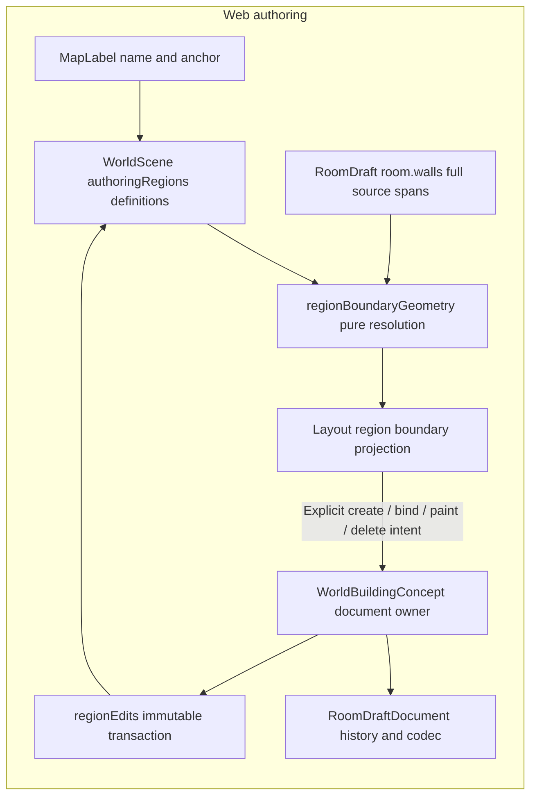

## Shape

Authoring areas are scene metadata, not `room.implicitRegionId`, floor,
concealment, collision or engine visibility. The geometry, intent and Layout
components consume the definition contract; the source map in
[the walkthrough](README.md) names their separate responsibilities.

## Law

- **R1 — Label and boundary have separate owners.** `MapLabel` owns text and
  anchor; `AuthoringRegion` owns one linked area's definition and identity.
  Existing notes are not inferred to be room labels.
- **R2 — Logical boundaries use every authored wall span.** Openings and door
  state do not remove area boundaries; display spans and meshes are not source
  geometry.
- **R3 — Acquisition is explicit.** Only create-room-label and bind/rebind may
  acquire a canonical `EnclosureWitness`. A definition without a witness stays
  unbound through render, wall changes and reload. A bound definition may recover
  only its accepted oriented walk; explicit paint replaces the definition only
  by author intent.
- **R4 — Resolution is pure and honest.** `RegionResolution` is transient;
  unresolved definitions keep IDs, links and intent, never a stale saved polygon.
  Unresolved geometry alone is valid metadata, not a publication prohibition;
  existing invalid-policy gates still hold.
- **R5 — One document owns accepted intent.** Each accepted change commits one
  immutable `RoomDraftDocument`, subject to the existing document, epoch,
  selection, cancellation and publishing fences. Exact no-ops add no history or
  storage writes. Pair deletion removes only region and label; raw linked label
  deletion refuses.
- **R6 — Scene3 is opt-in.** Scene1/2 refuse `authoringRegions`, retain their
  existing reads and are not upgraded by load. Label edits and resize preserve
  scene3; empty region collections are omitted without demotion. Authored empty
  explicit cells remain present. Storage envelope, room-draft and source-root
  versions are separate axes, not promoted with the scene.
- **R7 — Invalid intent fails closed.** Definitions have unique reserved IDs,
  one-to-one existing label links and exact variants. Unknown scene3 intent is
  refused, not stripped. Missing source walls are valid unresolved references.
  Comparison canonicalizes copies without rewriting accepted stored walks.
- **R8 — Capacity belongs to the document and workspace.** Regions are bounded
  by the existing 256-label budget; explicit cells are unique and bounded by
  actual workspace capacity when supplied. The existing 500000-character
  document budget bounds witnesses without a new wall cap. Shrink protects
  anchors, explicit cells and existing wall extents, never deletes floor/props.
- **R9 — Witnesses preserve oriented adjacency.** A witness is one cyclic source
  walk, mathematical X/Z CCW with interior on the left. Validate a simple face
  before same-source/same-direction compression, including the cyclic seam.
  New writes use the least code-unit tuple rotation `(wallId,direction)`;
  equality never sorts away adjacency or treats reversal as equivalent.
- **R10 — Geometry is conservatively supported.** A supported candidate is one
  bounded nonzero simple face with one ring: no holes, repeated geometric edges
  or vertices, interior slits, positive-length collinear overlap or coincident
  indistinguishable sources. Shared endpoints, certified axis T contacts and
  certified proper crossings may connect; uncertified classification/order or
  multiway coalescing is unresolved. No distance/epsilon welding. Extending
  these limits requires revisiting witness sufficiency.
- **R11 — Conflicts do not choose winners.** Duplicate room labels and positive
  area overlap remain unresolved. Explicit overlap is a cell-set question;
  adjacency is not overlap. Automatic conflicts include containment. No hidden
  floor/cell transfer or overlap priority repairs another definition.
- **R12 — Presentation is not gameplay.** This boundary contract has no region
  lighting/sound placeholders, runtime visibility, engine rules or provider
  acceptance claim. Such capabilities need their own owning contracts.

## Rulings

| ID     | status  | scope                                                                                         | ruled by                                                                                                                                                   | date                                |
| ------ | ------- | --------------------------------------------------------------------------------------------- | ---------------------------------------------------------------------------------------------------------------------------------------------------------- | ----------------------------------- |
| R1–R2  | settled | Room-label entry point, distinct notes, full-wall authoring boundary                          | KirkDiggler product agreement, [brief in #1245](https://github.com/KirkDiggler/rpg-dnd5e-web/issues/1245)                                                  | Agreement record in linked issue    |
| R3–R11 | settled | First boundary increment's technical contracts, lifecycle, validation and conservative limits | Parent-derived [checked plan](https://github.com/KirkDiggler/rpg-dnd5e-web/issues/1245#issuecomment-6082203160), not operator signoff of algorithm details | Checked-plan record in linked issue |
| R12    | settled | Boundary-only scope; visual lighting, sound and gameplay bridge are separate increments       | KirkDiggler product direction and parent-derived increment scope, [#1245](https://github.com/KirkDiggler/rpg-dnd5e-web/issues/1245)                        | Agreement record in linked issue    |

## Open

No required ownership or schema decision is open for this boundary increment.
Visual region-lighting controls and their relationship to placed-asset lights
are outside this contract (R12). Sound and engine illumination/visibility need
separate provider-owned contracts (R12). Curved/polyline sources, holes, exact
arithmetic fallback and broader angled junction support require an explicit
extension of the supported geometry and witness proof (R9–R10).
