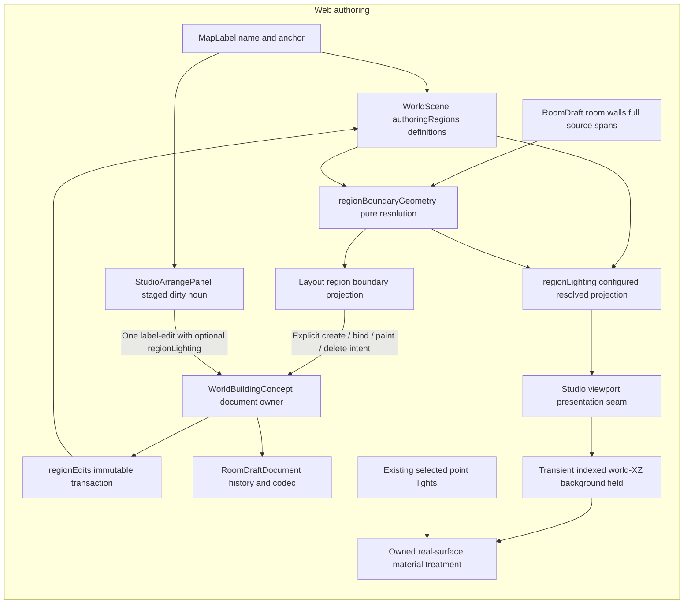

## Shape

Authoring areas are scene metadata, not `room.implicitRegionId`, floor,
concealment, collision or engine visibility. The geometry, intent and Layout
components consume the definition contract; the source map in
[the walkthrough](README.md) names their separate responsibilities.

## Law

- **R1 — Label and boundary have separate owners.** `MapLabel` owns text and
  anchor; `AuthoringRegion` owns one linked area's definition and identity.
  Existing notes are not inferred to be room labels.
- **R2 — Logical boundaries use every authored wall span.** Openings and door
  state do not remove area boundaries; display spans and meshes are not source
  geometry.
- **R3 — Acquisition is explicit.** Only create-room-label and bind/rebind may
  acquire a canonical `EnclosureWitness`. A definition without a witness stays
  unbound through render, wall changes and reload. A bound definition may recover
  only its accepted oriented walk; explicit paint replaces the definition only
  by author intent.
- **R4 — Resolution is pure and honest.** `RegionResolution` is transient;
  unresolved definitions keep IDs, links and intent, never a stale saved polygon.
  Unresolved geometry alone is valid metadata, not a publication prohibition;
  existing invalid-policy gates still hold.
- **R5 — One document owns accepted intent.** Each accepted change commits one
  immutable `RoomDraftDocument`, subject to the existing document, epoch,
  selection, cancellation and publishing fences. Exact no-ops add no history or
  storage writes. Pair deletion removes only region and label; raw linked label
  deletion refuses.
- **R6 — Scene versions are opt-in.** Scene1/2 refuse `authoringRegions`, retain their
  existing reads and are not upgraded by load. Label edits and resize preserve
  scene3/4; empty region collections are omitted without demotion. Only an actual
  lighting write opts in to scene4; reset and last-pair deletion retain scene4. Scene3
  refuses lighting, scene4 permits its absence. Authored empty explicit cells
  remain present. Storage envelope, room-draft and source-root versions are separate axes, not promoted with the scene.
- **R7 — Invalid intent fails closed.** Definitions have unique reserved IDs,
  one-to-one existing label links and exact variants. Unknown scene3/4 intent is
  refused, not stripped. Missing source walls are valid unresolved references.
  Comparison canonicalizes copies without rewriting accepted stored walks.
- **R8 — Capacity belongs to the document and workspace.** Regions are bounded
  by the existing 256-label budget; explicit cells are unique and bounded by
  actual workspace capacity when supplied. The existing 500000-character
  document budget bounds witnesses without a new wall cap. Shrink protects
  anchors, explicit cells and existing wall extents, never deletes floor/props.
- **R9 — Witnesses preserve oriented adjacency.** A witness is one cyclic source
  walk, mathematical X/Z CCW with interior on the left. Validate a simple face
  before same-source/same-direction compression, including the cyclic seam.
  New writes use the least code-unit tuple rotation `(wallId,direction)`;
  equality never sorts away adjacency or treats reversal as equivalent.
- **R10 — Geometry is conservatively supported.** A supported candidate is one
  bounded nonzero simple face with one ring: no holes, repeated geometric edges
  or vertices, or interior slits. Exact axis-collinear coverage forms one
  geometric span with transient source provenance; an overlapping straight
  boundary run requires exactly one source covering its entire face span.
  Multiple full-span owners or no full-span owner are unresolved, never chosen
  by ID, input order or length. Non-overlapping end-to-end source transitions
  retain their junctions. Shared endpoints, certified axis T contacts and
  certified proper crossings may connect; non-axis collinearity, uncertified
  classification/order or multiway coalescing is unresolved. Raw face validity
  precedes provenance/ring compression. No distance/epsilon welding or endpoint
  rewrite; uncovered intervals remain gaps. Extending these limits requires
  revisiting witness sufficiency.
- **R11 — Conflicts do not choose winners.** Duplicate room labels and positive
  area overlap remain unresolved. Explicit overlap is a cell-set question;
  adjacency is not overlap. Automatic conflicts include containment. No hidden
  floor/cell transfer or overlap priority repairs another definition.
- **R12 — Presentation is not gameplay.** Region background light is optional
  Web visual intent, not gameplay illumination, sight, discovery, occlusion or
  provider semantics. Placed light declarations remain independent. Sound and
  engine capabilities need their own owning contracts; Web codec tests do not
  establish provider acceptance.
- **R13 — Optional lighting has one owner and honest extents.** Scene4 alone
  permits `AuthoringRegion.lighting: {background: number}`, an exact finite
  0..1 shape without defaults. Absence is baseline appearance, distinct from
  authored `1`. Reset removes the field; equal set/reset-absent are reference noops.
  The existing label-edit intent joins dirty label fields and lighting into one
  fenced transaction. Only lighting present with text/location absent uses the
  ordinary document gate; explicit label fields (even equal values) and empty
  old label intent retain strict policy validation. Save/export gates remain
  strict. Pure projection includes only configured, currently resolved IDs;
  unresolved/conflicting intent persists without any applied or cached extent.
  Projection does not acquire a boundary or infer ownership from floor/props.

- **R14 — Lighting treats real surfaces, not scene output.** A transient indexed
  triangle field classifies rendered fragment X/Z with normal GPU precision;
  outside configured resolved extents is baseline. Closed shared edges take
  the minimum configured level, without source epsilon changes or raster
  dilation. Standard/Physical directional and indirect terms scale by background;
  point and emissive terms retain the existing Three path. The textured Basic
  workspace floor adds the same selected point list only where configured,
  independently of background. No overlay, whole-object membership, gameplay
  flood, light blocking or second source selection crosses this seam. One
  per-instance material owner composes memory and optional lighting on owned
  clones, includes companions/cap courses, restores originals and never disposes
  cached maps/geometry. Uniform/camera changes do not recreate materials or shader
  variants. Capacity, shader and unsupported-material failures visibly diagnose
  unapplied lighting; field-wide failure clears the binding rather than retaining
  stale geometry. Play, thumbnails, actors, guides and loading/error markers do
  not receive the Studio surface binding.

- **R15 — Linked-label controls stage author intent.** Background light (%) is
  numeric0..100. Absence displays blank with a100 placeholder and baseline status,
  not a prefilled value; deliberately entering100 authors1. Use baseline appearance
  stages null until Apply. Only dirty fields compose one label-edit. Apply/Enter
  accepts the whole noun or refuses it without partial writes; Cancel/Escape,
  collapse and view/target/epoch/document retirement discard linked-label staging.
  Blur never submits. Notes expose no region fields. Saved unresolved settings
  clearly say they are not applied until the boundary resolves. Point controls
  remain independent and no persistent toolbar band is introduced.

## Rulings

| ID         | status  | scope                                                                                                                                    | ruled by                                                                                                                                                                                                                                        | date                                              |
| ---------- | ------- | ---------------------------------------------------------------------------------------------------------------------------------------- | ----------------------------------------------------------------------------------------------------------------------------------------------------------------------------------------------------------------------------------------------- | ------------------------------------------------- |
| R1–R2      | settled | Room-label entry point, distinct notes, full-wall authoring boundary                                                                     | KirkDiggler product agreement, [brief in #1245](https://github.com/KirkDiggler/rpg-dnd5e-web/issues/1245)                                                                                                                                       | Agreement record in linked issue                  |
| R3–R9, R11 | settled | First boundary increment's technical contracts, lifecycle and validation                                                                 | Parent-derived [checked plan](https://github.com/KirkDiggler/rpg-dnd5e-web/issues/1245#issuecomment-6082203160), not operator signoff of algorithm details                                                                                      | Checked-plan record in linked issue               |
| R10        | settled | Conservative geometry with exact axis coverage and unique full-run source provenance                                                     | Parent-checked bounded geometry repair, owning scope [#1245](https://github.com/KirkDiggler/rpg-dnd5e-web/issues/1245); not operator signoff of a general polygon kernel                                                                        | 2026-10-10                                        |
| R12–R15    | settled | Optional visual lighting, scene4 opt-in, single transaction, honest projection and owned real-surface treatment; gameplay/sound excluded | KirkDiggler [product agreement](https://github.com/KirkDiggler/rpg-dnd5e-web/issues/1245#issuecomment-6093673500) and parent-derived [checked technical plan](https://github.com/KirkDiggler/rpg-dnd5e-web/issues/1245#issuecomment-6093792827) | Agreement and checked-plan record in linked issue |

## Open

No required ownership or schema decision is open for optional visual intent.
Sound and engine illumination/visibility need separate provider-owned contracts
(R12). Curved/polyline sources, holes, exact arithmetic fallback and broader angled junction support require an explicit
extension of the supported geometry and witness proof (R9–R10).
