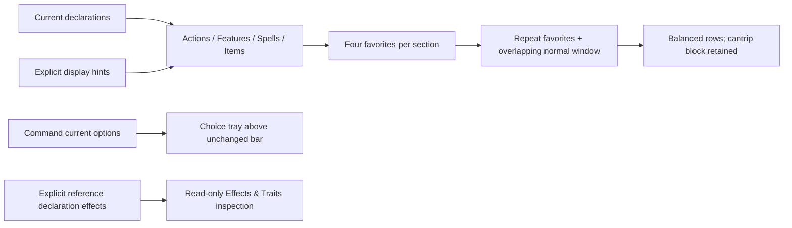

# Grouped favorites iteration — #1225

Authority: operator approved Actions / Features / Spells / Items, cantrips grouped inside Spells, a separate informational Effects & Traits section, a Command choice tray that preserves context, balanced rows, and replacing drag order with favorites repeated on every page. Final short pages overlap the tail of the previous page. Operator explicitly chose **four favorites per section**, not a smaller screen-dependent cap; players can select fewer on narrow screens. Baseline `e9ce37d5`. Existing design/verification history: [PLAN.md](PLAN.md).

Scope: fixture-only desktop opt-in; fixed Status, notices/history and original mobile/default paths remain. No persistence or live promotion. Preference keys remain fixture declaration IDs, not a durable live identity contract.

## Shape

## Task 12 — grouping and favorite-window model

**Files/owner:** combat-experience `desktopHotbarLayout.ts`/`.test.ts`, new `desktopHotbarGroups.ts`/`.test.ts`; `organizedActionPresentation.ts` display-hint types.
**Interfaces:** sections actions/features/spells/items; `DesktopHotbarLayout {rows:1|2|3|4, favoriteIdsBySection:Partial<Record<section, readonly string[]>>}`. Max4 per section including all Spells subgroups combined. New explicit `desktopSectionByDeclarationId`, `desktopSpellKindByDeclarationId` (cantrip/leveled); current CAST defaults Spells, other executable offers default Actions unless explicitly classified. Unknown spell kind gets a clearly unclassified block, never inferred from cost/name/class.
**Behavior:** existing organizer/registry owns membership. Empty section shows no fabricated offer. Order within normal items stays provider/fixture order; favorites retain selection order, inside their original subgroup. Normalize duplicate/unknown favorite IDs against current section members. A fifth favorite is refused with clear local UI feedback; unstar stays available. Four stays four on resize.
**Window contract:** for capacity8, favorites[A,B], normal[C..L], page1=[A,B,C,D,E,F,G,H], page2=[A,B,G,H,I,J,K,L]. `normalCapacity=max(1,capacity-favorites)` when normals exist; `start=min(page*normalCapacity, max(0,normalCount-normalCapacity))`. No duplicate within a page. Balanced visible columns=ceil(visibleCount/rows), with decorative blank cells for odd totals.12 offers/two rows =>6+6. Full final windows keep favorite cell positions stable. Page clamped after resize/withdrawal.
**Spells:** separate cantrip/leveled/unknown bands under one section header/pager. Each band has its own measured capacity and repeats its favorites. The section page count is the maximum of band page counts; shorter bands stay on their last full window. This retains grouping without mixing favorites from different kinds.
**Narrow screens:** minimum band width reserves all favorites plus a normal slot when needed. If sections cannot fit, only their horizontal rail scrolls; no automatic extra rows, no silently dropped favorites or smaller cap. Empty/unknown data is explicitly handled.
**Tests:** exact example, balanced12/2 and odd count, all favorite/zero normal, capacities smaller than favorite count, max4, unknown/duplicate/withdrawn IDs, no starvation, original membership/availability, explicit feature/item classification, cantrip grouping independent of cost, unknown classification.

## Task 13 — grouped favorite UI and controlled preview state

**Files:** rewrite DesktopActionSurface.tsx as inspector/composition owner; new DesktopActionSection.tsx and ActionArt.tsx; update DesktopActionSurface.module.css/tests; OrganizedHudConcept.tsx/organizedHud.css; desktop-hotbar fixtures/tests.
**Interfaces:** section child consumes groups, rows, favorite IDs and callbacks; owns local page/measurement only. Shared art renderer retains load-error fallback/tint. Harness replaces per-profile order with per-profile favorites, globally shared row count. Version the in-memory preference shape so HMR cannot reinterpret old drag order as favorites.
**Behavior:** Edit stars/unstars, never dispatches. Normal click selects exact current available declaration. Remove drag and Move-first/earlier/later controls. Section counter shows n/4; fifth-star refusal is a presentation message, not a game refusal. Disabled offers remain visible and favoritable in Edit. Favorites marked outside Edit and repeated in fixed leading cells within their band. Rows/canvas sizes do not unstar preferences. Empty Features/Items show `No offers` (not `no inventory/features`). Add Unarmed Strike as an explicitly authored attack fixture, not a new rule/provider verb. Preserve source hints for the original mobile comparison.
**Tests:** Edit cannot execute, four accepted/fifth refused, unstar replacement, resize/page persistence, no drag, cantrips contiguous; all offers reachable, no End Turn/info rows in preference lists. Retain active targeting/authority regression tests.

## Task 14 — contextual choice tray and informational effects

**Files:** ActionDock.tsx, OrganizedActionSurface.tsx props, DesktopActionSurface.tsx/module.css, TargetSurface.tsx, CombatExperience.tsx, DesktopStatusSection.tsx; new DesktopEffects.tsx/module.css/tests; fixtures.
**Command contract:** desktop option selection no longer replaces the bar. Pass the currently resolved option declaration/callbacks into the desktop surface. Chevron advertises options. Tray uses exact option IDs/labels; checks fresh authority/current membership before callback. Cancel/Escape closes choice only; another action switches directly. Selected variant label is echoed beside Command during targeting. Change choice reuses existing select-declaration callback without spending. Default/mobile keep existing option group.
**Measured provider gap:** installed CastOption has only id/label. No descriptions are available. Show the absence plainly instead of inventing mechanics; rich option descriptions remain provider work before claiming that part complete. This does not block the choice-tray layout prototype.
**Informational contract:** optional `desktopEffectsDeclarationId` selects an explicit current declaration as a reference when no selected action supplies effects. Render its exact `effectLinesFor` rows with a visible action-context label; selected matching targets use supplied candidate overrides. Do not aggregate unrelated action answers or claim unconditional passive applicability. Missing reference => no invented rows; stale authority qualified. Martial reference fixture already has Raging/Sneak Attack; add an explicit Bless row to the cleric Mace fixture. Icons supplied by display hints, not rules recognition. Read-only effects live below Status, scroll horizontally if numerous, never enter favorites/action/page lists. Hover/focus inspects; click pins an explanation, outside click/Close/Escape dismisses; no execution callback. Context and conditional words stay visible.
**Tests:** bar/status remain during choices; option callback exact and blocked stale/withdrawn; selected label displayed; cancellation/switching; default path preserved. Effects click does not select a declaration, current engine states/reasons displayed, target answers contextual, stale/missing references truthful.

## Task 15 — integrated browser proof and records

**Files:** ignored `evidence/desktop-hotbar/favorites.mjs`/JSON/screenshots; update CONTRACT/this plan/issue1225.
**Proof:** 1000/1280/1600 desktop, rows1/2/4, balanced rows/empty slots; four favorites retained across pages/resize, final overlapping page exact, no document overflow (rail can scroll), unknown spell metadata handled; current availability refreshed. Command tray plus choice/target/cancel intact. Martial Effects & Traits shows Raging/Sneak Attack as information, not actions. Status/log/notice controls still work; compact844x390/393x852 uses original organizer. Inspect rendered screenshots.
**Commands:** worktree `npm run typecheck`; focused Vitest for helper/section/surface/concept/effects/ActionDock/TargetSurface/CombatExperience regressions; changed-file ESLint/Prettier. Native Chrome/SwiftShader probes. Full CI only at PR boundary; independent review/promotion not claimed.

## Coverage and seam checks

| Requirement                              | Task     | Proof                                                            |
| ---------------------------------------- | -------- | ---------------------------------------------------------------- |
| Four favorites, not screen-punished      | 12,13,15 | fifth refusal test; four retained in narrow rail; rows unchanged |
| Balanced rows and overlapping final page | 12,13,15 | exact8-slot example and12/2; browser cell bounds                 |
| Player-facing groups, cantrips together  | 12,13    | membership/tier tests, screenshot                                |
| Informational Raging/Sneak Attack        | 14,15    | real effect rows/context, no execution                           |
| Command submenu preserves context        | 14,15    | same bar retained, exact option and variant label                |
| Existing status/notice/mobile behavior   | 13–15    | regression tests and compact walk                                |

| Producer                     | Consumer                   | Produced vs consumed                                                | Availability        | Proof                         |
| ---------------------------- | -------------------------- | ------------------------------------------------------------------- | ------------------- | ----------------------------- |
| organizer/registry           | grouping helper            | existing executable members; display hints cannot mint offers       | existing            | membership/unknown tests      |
| window model                 | section renderer           | repeated favorites + normal window + balanced columns/slots         | Task12 before13     | exact IDs and geometry        |
| harness preference state     | desktop customization      | same favorite map, max4 per section, in-memory only                 | Task13              | roundtrip and HMR shape guard |
| ActionDock option resolution | choice tray                | current available CAST options/IDs, unchanged callbacks             | existing +14        | stale/withdrawal/cancel tests |
| current declaration effects  | read-only effects renderer | canonical rows + supplied candidate overrides, named action context | existing helper +14 | no inferred global states     |

Checks: user replaced arbitrary ordering intentionally; old drag acceptance is superseded. No new game rules, provider release pins or persisted settings. Narrow rail is an explicit presentational consequence of honoring four favorites, not a hidden cap. Missing option descriptions are reported, not faked. Passive-effect scope stays named because current wire answers are action/target-specific. Item execution is not invented; an empty Items section is truthful. Tasks ordered12→13→14→15; no merge/release dependency outside web.

## Completion evidence and remaining gap

- Implemented the layout portion of tasks12–15. Typecheck, changed-file lint/format and201 focused tests pass, including exact A/B overlap, four-favorite cap, mixed cantrip/leveled cap, four-row balancing, invalid option identities, current authority and information-only effects. Old drag helpers/UI are removed rather than retained as a second preference mechanism.
- Browser `favorites.mjs` in native Chrome/SwiftShader passes:12 spells in two rows are6+6; four pins keep the same positions on every page; all25 normal leveled offers are reachable and the final measured7-offer tail is exact; four survive resize with rows unchanged. A deliberately constrained440px action rail verifies scroll rather than lost pins/document overflow.
- Command choices retain the same mounted bar and icon geometry; selecting Grovel labels targeting, Change choice/Cancel/Escape/switching work. Change choice belongs in the targeting prompt rather than the footer to avoid reflow. Invalid/missing choice identities/labels fail visibly and cannot dispatch.
- Martial shows Second Wind as a Feature and Raging/Sneak Attack as information with named Longsword context; inspecting sends no intent. Named target context is included when present. Four rows/Edit at1000×501 keep the popup in bounds. The first screenshot showed the lab Controls chip obscuring the context caption; a desktop-only short-frame rule moves that lab chip away, verified by an overlap assertion. Mobile stays on the previous organizer.
- Updated status and notice/history probes pass. New group captions and Effects & Traits make the ready dock about134.5px high, replacing the earlier113px checkpoint. Source assets remain ignored; no new licensed bytes are tracked.
- The first geometry probe took a snapshot while ResizeObserver was still reconciling a restored rail width; it now waits for rendered capacities to match measured widths. Evidence and inspected screenshots are under ignored `evidence/desktop-hotbar/{favorites,status,story-notices}.json` and PNGs.
- **Remaining provider work:** option-rule descriptions are still absent from CastOption. Their explanatory-tooltip portion is not implemented or claimed; the tray uses real IDs/labels and states the gap. Effects remain explicitly action/target-scoped; global passive-catalog promotion, durable player preferences, full PR-boundary CI and independent review also remain outside this completed local layout increment.
