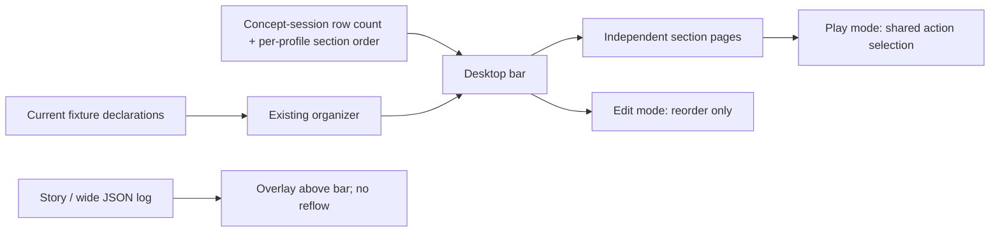

# Desktop hotbar concept plan

Current iteration: [FAVORITES-PLAN.md](FAVORITES-PLAN.md). The earlier drag-order and quick/abilities arrangements below are historical checkpoints, superseded by grouped favorites.

## Goal, authority and constraints

Authority: https://github.com/KirkDiggler/rpg-dnd5e-web/issues/1225. Approved in conversation by KirkDiggler: browse spells without opening a collection, hover/focus to inspect, click to select; readable opaque inspection above the bar; unavailable offers remain inspectable; existing mobile presentation and live route unchanged. Scope is a fixture-only Concepts Lab experiment, not promotion. Reuse the real CombatExperience/ActionDock gates, generated declarations and targeting. No rule calculations, RPCs, new provider dependencies, persistence or events. Licensed sprites remain ignored local runtime assets, never tracked.

Baseline: rpg-dnd5e-web dev `7d4bcb1e9f9cc5be46504f7ddd62c034d55b40d6`. Inspected OrganizedActionSurface, organizeDeclarations/currentExecutableDeclaration, ActionDock, CombatExperienceActionPresentation, OrganizedHudConcept, its fixtures/tests, ConceptsView, organizedHud.css and CombatExperience.module.css. Existing inspection uses rgba(7,13,15,.62) and overlays an open tray. Existing actionTooltip projects costs/targets/effects/refusal but the cast reference does not supply full spell rules text. This prototype does not fabricate missing spell descriptions.

## Sequence

Task 1 -> Task 2 -> Task 3. Web only, no release/repin dependency. No live promotion, automatic merge or independent-review claim. Operator walkthrough precedes any promotion. Full CI is required at the PR boundary; focused checks and browser proof are required for this local preview.

## Task 1: Opt-in shared icon surface

**Delivers:** R1 direct browsing, R2 inspection, R3 availability/identity safety.
**Owner:** web combat-experience presentation.
**Prerequisites:** existing generated Declaration fields and organizer/executable lookup.
**Files:** new `src/components/session/combat-experience/DesktopActionSurface.tsx`, `DesktopActionSurface.module.css`, `DesktopActionSurface.test.tsx`; modify `organizedActionPresentation.ts` and `OrganizedActionSurface.tsx`.
**Interfaces:** optional `desktopIcons` map on OrganizedActionPresentation, keyed by declaration id, values `{src: string; fallback: string; tone: 'gold'|'green'|'blue'|'violet'}`. Presence opts into DesktopActionSurface; absent preserves existing surface. Component consumes the same declarations, authorityFresh, selection/cancel and utility props as the organizer. Art metadata never establishes membership, names or availability.
**Behavior:** all organizer groups are visible without collection buttons. A focusable aria-disabled button remains inspectable but cannot select. Hover/focus displays a solid card above the entire tray; Escape dismisses inspection; pointer can enter/scroll the card. Lookup against current props on click. Withdrawn offers lose inspection; missing/broken art falls back to readable short lettering with an accessible full name. No native title duplication. Overflow wraps icons rather than hiding spells behind a menu. Selection and cancel retain existing callbacks.
**Tests:** all spells visible before any click; hover/focus produce tooltip without dispatch; disabled/stale click cannot dispatch and refusal is visible; current replacement row dispatched; withdrawn inspection removed; Escape closes; missing artwork fallback; End Turn excluded from icon grid.
**Verification:** worktree `npm run test:run -- src/components/session/combat-experience/DesktopActionSurface.test.tsx src/components/session/combat-experience/OrganizedActionSurface.test.tsx`; typecheck. Browser geometry separately proves opaque background, no action overlap and stationary icons on hover.

- [x] Add tests and surface; run focused tests.
- [x] Preserve default organizer behavior and existing gates.

## Task 2: Cleric fixture and shared-shell concept

**Delivers:** R4 comparable isolated walkthrough, R5 mobile preserved, R6 local Synty sample.
**Owner:** web Concepts Lab fixtures and composition.
**Prerequisites:** Task 1; existing OrganizedHudConcept and SessionCombatMap.
**Files:** new `src/concepts/desktop-hotbar/fixtures.ts`, `DesktopHotbarConcept.tsx`, `DesktopHotbarConcept.test.tsx`, `CONTRACT.md`; modify `src/concepts/organized-hud/OrganizedHudConcept.tsx`, `organizedHud.css`, `src/concepts/ConceptsView.tsx`.
**Interfaces:** parameterize OrganizedHudConcept with typed profiles/title/concept id and optional icon comparison. Current default unchanged. Concept frame ResizeObserver opts into desktopIcons only for frame >=1000px wide and >500px high; absent measurement starts with safe original mobile layout. Current-layout comparison uses identical declarations without desktopIcons. Profiles remain explicit fixtures, not runtime class inference.
**Behavior:** cleric-style Mace/Move/Resistance/Toll the Dead/Bane/Bless/Command/Cure Wounds/Healing Word plus general abilities; available, spent action (Healing Word stays available), spent slots, stale and spectator scenarios. Reuse martial profile for comparison. Spell candidates/options are explicit fixture content. Fixture-only selection receipts; no rule execution. Preview at `?concept=desktop-hotbar&preview=1`, return through standard Lab entry. Use named local sprite URLs under ignored `public/models/synty/interface-preview/`; preserve fallback when absent. No licensed files in git.
**Tests:** direct cast reaches shared targeting; Command reaches shared option chooser; cancel resets; stale/spectator gates; mobile uses existing organizer; art hints cannot mint offers. Existing OrganizedHudConcept tests stay green.
**Verification:** `npm run test:run -- src/concepts/desktop-hotbar/DesktopHotbarConcept.test.tsx src/concepts/organized-hud/OrganizedHudConcept.test.tsx`; browser walkthrough at 1600x900, 1280x720, 844x390 and 393x852.

- [x] Add fixture/composition tests and implement registration.
- [x] Stage selected art only in ignored private paths and document provenance locally.

## Task 3: Walkthrough evidence and preview

**Delivers:** integrated acceptance evidence and reachable preview.
**Owner:** web local environment and concept documentation.
**Prerequisites:** Tasks 1–2; existing browser Playwright installation, local model assets.
**Files:** ignored `evidence/desktop-hotbar/` for screenshots/browser probe; update this plan and CONTRACT with actual commands and limitations.
**Interfaces:** Vite dev server on a free local port, development query entry; no provider writes or server changes.
**Behavior/tests:** hover every spell without clicking; tooltip foreground opaque, above bar, in viewport, unchanged offer bounds. Inspect unavailable Cure Wounds and click Healing Word. Select Command then an option. Open log while browsing; narrow layout keeps existing collection controls and no page overflow. Unknown/broken image fallback works. Check no licensed tracked files. Browser rendering—not just rectangle checks—is required.
**Verification:** focused tests, `npm run typecheck`, changed-file ESLint/Prettier, Playwright screenshots and read images. Full `npm run ci-check` only before PR publication. Report preview URL and known limits; do not claim live fix or acceptance before operator walk.

- [x] Capture and inspect rendered desktop/mobile evidence.
- [x] Record checks and provide URL.

Completion evidence: 38 focused tests passed; typecheck and changed-file lint/format passed. Browser assertions and inspected screenshots at 1600×900, 1280×720, 844×390 and 393×852 are recorded in ignored `evidence/desktop-hotbar/verification.json`. Preview: `http://localhost:3031/?concept=desktop-hotbar&preview=1`. See CONTRACT.md for checks and limits. Full CI/review deferred to publication at the PR boundary, not claimed here. No production promotion.

Implementation detail correction: frame measurement and comparison fit inside the parameterized existing harness without new global concept CSS; `organizedHud.css` was left unchanged. Dependencies copied from the root were stale; installing the tracked lockfile in this worktree fixed the typecheck without changing package pins.

## Requirement coverage

| Requirement / acceptance                    | Task | Concrete proof                                                        |
| ------------------------------------------- | ---- | --------------------------------------------------------------------- |
| R1 Browse without opening menu              | 1,2  | all cleric spells visible on initial desktop render                   |
| R2 Hover/focus inspection, opaque above bar | 1,3  | no-dispatch tests; screenshot and geometry/opacity probe              |
| R3 Unavailable inspection, current identity | 1,2  | spent action/slots/stale/replacement/withdrawal assertions            |
| R4 Same real shell, no live changes         | 2    | shared TargetSurface and cast options tests; default regression tests |
| R5 Mobile unchanged                         | 2,3  | frame observer + original surface; 844x390 / 393x852 screenshots      |
| R6 Synty local sample                       | 2,3  | images loaded, fallbacks, git ignored-path check                      |

## Provider/consumer seams

| Provider                               | Consumer             | Produced vs consumed                                | Availability                   | Proof                                       |
| -------------------------------------- | -------------------- | --------------------------------------------------- | ------------------------------ | ------------------------------------------- |
| generated Declaration + actionTooltip  | DesktopActionSurface | exact names/costs/refusals; no description invented | existing installed protos      | tooltip and refusal assertions              |
| organizer/currentExecutableDeclaration | DesktopActionSurface | executable membership and current available row     | existing                       | end-turn exclusion, replacement/stale tests |
| desktopIcons fixture                   | organizer wrapper    | optional id-keyed art metadata only                 | Task 2 after Task 1 type       | defaults unchanged; missing art test        |
| parameterized OrganizedHudConcept      | DesktopHotbarConcept | same state/callbacks/real CombatExperience          | Task 2                         | cast target/option/cancel tests             |
| frame ResizeObserver                   | desktopIcons opt-in  | >=1000 width and >500 height; otherwise absent      | browser; mocked bounds in test | desktop/mobile browser matrix               |
| local licensed sprites                 | icon image           | named ignored URLs; fallback if load fails          | local only                     | load verification and git check             |

Plan checks: no changed wire, persistence, events or package pins. Full spell descriptions are absent at the inspected seam; tooltip keeps available facts rather than inventing mechanics. Layout threshold is local experiment sizing, not a production device policy. Existing accepted mobile behavior remains the fallback. No required architectural decision left open for this bounded concept.

## Iteration 2 — density and icon coverage

Authority: operator liked the first preview and requested less vertical space, smaller icons, a check against dozens of offers and a glyph coverage audit; identified Dodge/Stealth confusion and suggested color. Inspected baseline `8dbe36e8` and all five local INTERFACE archives. No new gameplay semantics or production changes.

### Task 4: Dense, tinted icon experiment and honest coverage gaps

**Delivers:** R7 smaller footprint, R8 dozens-of-icons proof, R9 distinct glyph audit and non-misleading Dodge fallback, R10 tinted glyphs (not just borders).
**Owner:** web shared presentation and concept fixtures.
**Prerequisites:** Tasks 1–3, local licensed clean glyph files.
**Files:** modify `DesktopActionSurface.tsx`/`.module.css`/`.test.tsx`, `src/concepts/desktop-hotbar/fixtures.ts` and `DesktopHotbarConcept.test.tsx`; add `ICON-AUDIT.md`; update CONTRACT/PLAN. No changes to the original organizer.
**Interfaces:** same optional desktopIcons metadata. An empty src explicitly uses its short-letter fallback. ActionArt uses the source alpha as a CSS mask colored by the existing tone; image load failure preserves the tested fallback. No new provider API. Crowded fixture appends 25 clearly named layout-only sample declarations to the existing 11 visible actions; END_TURN remains separate.
**Behavior:** 40px desktop buttons (previously 58), 24px glyphs; remove persistent tutorial row, combine utilities/cancel into one compact row, keep section headings. Crowded groups share available width proportionally and wrap without hiding offers; no paging or sorting policy introduced. Opaque tooltip stays above the complete surface. Dodge uses the explicit Do fallback until an appropriate evasion glyph is selected/authored, not the stealth hood. New stress scenario clearly marks artificial samples; no fictional rules descriptions.
**Tests:** 36 visible offers before any click; sample hover does not dispatch; all ids distinct; Dodge not mapped to Stealthy; color mask uses selected source and fallback still works. Browser assertions: ready surface <=115px high; crowded <=180px at 1280x720 with normal log open; all 36 icons inside surface and viewport with no overlap; keyboard/hover inspection intact and tooltip does not cover offers. Re-run compact mobile evidence unchanged.
**Verification:** same focused test/typecheck/lint commands; updated ignored Playwright probe at 1600x900/1280x720 and phone sizes. Read screenshots. Audit excludes input-device icons and counts clean representations separately from semantic coverage.

| Requirement            | Implementing task | Proof                                                     |
| ---------------------- | ----------------- | --------------------------------------------------------- |
| R7 smaller bar         | 4                 | measured icon size40 and ready height <=115px             |
| R8 dozens              | 4                 | 36-offer fixture assertion and browser bounds at 1280x720 |
| R9 icon coverage/Dodge | 4                 | ICON-AUDIT with reproducible counts; no Stealthy mapping  |
| R10 colored art        | 4                 | mask source/tone test and inspected screenshot            |

| Provider                               | Consumer                 | Produced vs consumed                                                      | Availability                    | Proof                                              |
| -------------------------------------- | ------------------------ | ------------------------------------------------------------------------- | ------------------------------- | -------------------------------------------------- |
| existing desktopIcons.src/tone         | ActionArt                | same alpha image plus presentational color; empty/broken src -> lettering | local staging, no bytes tracked | mask and fallback tests                            |
| 25 explicit layout sample declarations | shared organizer/surface | generated rows only; 36 executable offers total                           | new fixture, no rules authority | count/no-dispatch test + actual shell browser walk |

Plan check: smaller controls apply only to opt-in desktop experiment; mobile untouched. Color conveys no new rules or availability. No claim that file count proves full D&D coverage. Glyph authoring/selection for semantic gaps remains operator iteration, not guessed by the renderer.

Task 4 completion: 40 focused tests and typecheck passed. Browser `density.mjs` measures 112px ready / 156px crowded at both 1600×900 and 1280×720, 36 distinct 40px offers in bounds with no overlap and a separate opaque inspection card. Screenshots read after rendering. Existing `verify.mjs` regression passed, including 844×390 / 393×852 fallback; its first combined invocation timed out and the standalone rerun passed. Audit result: 611 clean files, 457 byte-distinct normalized alpha masks, no claim of complete semantic coverage. Dodge remains a named art gap with a labeled fallback. New files are text/code only; licensed sprites stay ignored.

## Iteration 3 — player arrangement, rows, paging and log overlay

Authority: operator confirmed full width, one row by default with 1–4 rows for the whole bar, independent section paging for players keeping fewer rows, and player ordering within sections behind an explicit Edit button. Artwork/color is NOT player editable. Log/debug JSON must overlay the bar without reflow or click-through. Baseline `fccf0d79`; inspected CombatExperience, StoryLog/DebugEventRow, ActionDock, organizer, DesktopActionSurface and the concept harness. Desktop-only concept; no persistence, live caller, provider change or server preference contract.

### Task 5: Bounded layout model and editable paged surface

**Owner/files:** combat-experience; new `desktopHotbarLayout.ts`/`.test.ts`; modify DesktopActionSurface TSX/CSS/tests and organizedActionPresentation.ts.
**Interfaces:** `DesktopHotbarLayout { rows: 1|2|3|4; orderBySection: Partial<Record<DesktopHotbarSection, readonly string[]>> }`; section keys quick/spells/abilities/items/actions. Optional `desktopCustomization: { layout; onChange(layout): void }` on presentation; absent uses component-local default for standalone callers. IDs are explicitly fixture-local declaration IDs, NOT a proposed durable production identity. Helpers order only current members (ignore duplicate/unknown hints, append new offers), clamp rows/pages, calculate capacity from 36px buttons +4px gaps, and move a current ID to a current index inside one section.
**Behavior:** measured section width defines columns, rows defines height, page size=columns\*rows. Rows default1, max4; pages independent and clamped after resize/withdrawal. Empty sections absent; offers never invented or discarded, availability does not affect ordering. Section widths do not vary with row count, page or log state. 36px buttons/22px glyphs. Edit bar enters an explicit non-executing arrangement mode and cancels any armed selection. Drag/drop within a section, or select an icon then Move first/earlier/later; cross-section/external/withdrawn drops ignored. Paging remains available while editing so a later-page favorite can move first. Done/Escape exits edit and clears drag/inspection without executing an action; edits apply locally immediately. No artwork picker.
**Tests:** order dedupe/unknown/new membership; move boundaries/cross-section refusals; rows1..4 and capacity/page clamp; default one row and per-section page independence; editing cannot dispatch even disabled icons; reorder by keyboard controls and drag; normal play cannot drag; exit restores exact current declaration selection; stale/withdrawn identity behavior preserved.
**Verification:** focused helper/surface tests, typecheck/lint, browser resize/page/edit interactions. Geometry is browser proof, not jsdom.

### Task 6: Full-width shell, retained concept preferences, real debug fixture

**Owner/files:** CombatExperience.tsx/module.css; OrganizedHudConcept.tsx; desktop-hotbar fixtures/tests/CONTRACT.
**Prerequisites:** Task5 types and component contract.
**Interfaces:** root `data-desktop-hotbar` only when desktopIcons opt-in exists. Concept owns session-only rows and order per profile; supplies controlled customization, preserving choices through compact fallback, comparison, scenarios and options remounts. Log mode state enabled only for icon experiment; fixture debug accepts existing DebugFeedEntry and includes generated Event for real JSON inspection.
**Behavior:** bar spans the available frame width, with bottom utility space reserved for existing End Turn/collapsed Log controls. Open log is absolutely overlaid above the icon region, stopping short of turn controls; wide JSON changes only its width, never the bar. Log receives pointer input above icons and their tooltip. No edits to default/mobile shell selectors or action authority gates. Restore Dodge hood with a distinct tint as clarified by operator; it remains an explicit prototype mapping, not inferred rules or user-customizable art.
**Tests:** preference survives scenario and compact/current-layout roundtrips, rows shared across profiles but ordering profile-local; Debug tab and actual formatted event JSON work; legacy organized concept tests unchanged. Browser: bar spans frame at1600/1280; debug JSON overlap is topmost at elementFromPoint and clicking it does not select underlying action; log changes leave icon bounds unchanged; End Turn stays accessible.
**Verification:** targeted concept/StoryLog tests plus browser screenshots. No production/persistence dependency or merge/release wave.

### Task 7: Acceptance walkthrough and records

**Files:** ignored evidence/desktop-hotbar/paging.mjs, screenshots/JSON; update CONTRACT/PLAN and issue1225.
**Proof:** default1 row; all36 offers reachable by section paging; four rows expose more icons without changing order; promote sample25 first in Edit without dispatch and retain after Done/scenario switch; native drag reorder; no normal-mode drag; log/JSON overlap captures input; compact844x390/393x852 unchanged; screenshots read. Full PR-boundary CI/review remain deferred, no promotion claim.

| Requirement                              | Tasks | Concrete proof                                                            |
| ---------------------------------------- | ----- | ------------------------------------------------------------------------- |
| Full width + smaller icons               | 5,6,7 | frame/bar bounds, 36px button measurement                                 |
| 1–4 rows + independent paging            | 5,7   | default/clamp tests; all36 reachable at1 row, more visible at4            |
| Explicit safe Edit ordering              | 5,6,7 | zero dispatch while edit/drag, same-section moves, exit/play assertions   |
| Keep useful order across preview changes | 6     | controlled preference tests; no localStorage/RPC                          |
| Log above bar, no reflow/click-through   | 6,7   | actual Debug JSON, stable bounds and elementFromPoint/click assertions    |
| Existing mobile/live unchanged           | 6,7   | opt-in root attr absent on fallback; existing tests + compact screenshots |

| Provider                | Consumer                         | Contract comparison                                                                | Availability           | Proof                              |
| ----------------------- | -------------------------------- | ---------------------------------------------------------------------------------- | ---------------------- | ---------------------------------- |
| current organizer       | layout helpers/surface           | declarations stay canonical; hint IDs only reorder existing section members        | existing               | membership/stale/withdrawal tests  |
| Task5 layout type       | concept controlled customization | same rows1..4 and partial per-section ID order; callbacks change presentation only | Task5 before6          | roundtrip tests                    |
| section ResizeObserver  | pager                            | measured width -> bounded columns/page; undefined measurement uses safe1 column    | browser + mocked tests | native viewport/page proof         |
| concept generated Event | real StoryLog/DebugEventRow      | existing DebugFeedEntry event/schema JSON, no fabricated transport                 | installed protos       | formatted JSON + wide overlay test |
| desktopIcons opt-in     | shell CSS data attr              | absent preserves default selectors; present full-width overlay layout              | Task6                  | regression + browser geometry      |

Plan checks: rows/paging supersede the prior all-visible36 acceptance intentionally, per operator. No blanket approval for durable player settings; preview preferences remain in memory. Unavailable actions retain slots. Paging and edit mode are local presentation state only; no new legality or authority rule. All new seams have producers/tests; no required unresolved architectural decision for this concept increment.

Tasks 5–7 completion: `typecheck` and changed-file lint/format pass; 73 targeted helper/surface/concept/log tests plus48 CombatExperience/death-save regressions pass (121 total). Browser `paging.mjs` exercises native drag in Edit, later-page Move first, all36 reachable by independent pages, four rows, controlled-preference roundtrips, true formatted event JSON at640px, no log-induced icon movement or click-through, and accessible End Turn. Full-width default row measures113px high at1280×720/1600×900. Screenshots inspected. Compact844×390/393×852 unchanged; an extra1000×501 four-row/Edit check motivated measuring surface height to bound the tooltip to the remaining viewport, and passes; height500 switches back to compact. Evidence: ignored `evidence/desktop-hotbar/paging.json` and PNGs. Existing `density.mjs` expectations are superseded by the approved paging design. No persisted settings, production caller, PR readiness or live promotion claimed. The additional hover/refusal/Command/keyboard/mobile regression passed under SwiftShader after default-renderer viewport-transition stalls; the harness now awaits actual compact-surface transition rather than a fixed500ms delay. A minimal native spent-action probe also passed; no application defect was diagnosed from the stalled harness runs.

## Iteration 4 — temporary narration, optional history

Authority: operator wants who did the thing and what it was shown temporarily as it happens; opening the log is for catching up on missed activity. Also requested more side cushion and translucent bar backing. Baseline `a1ccc61c`. Moving HP/AC/movement into their own section remains a design possibility, not part of this narration increment.

### Task 8: Shared story notices with bounded lifecycle

**Owner/files:** combat-experience; new `useStoryNotices.ts`/`.test.tsx`, `StoryNotices.tsx`/`.module.css`; modify types.ts, CombatExperience.tsx, StoryLog.tsx and focused tests.
**Inputs/outputs:** optional `storyFeedback: {scopeKey: string}` on CombatExperience. Hook consumes the same `revealedStory` as the log (after existing dice/roll release gates), scope, enabled and streamState; returns recent current story entries. Existing eyebrow/context and headline stay prominent, detail secondary, verbatim. No actor inference, text parsing, wire changes or new game rules.
**Behavior:** baseline initial history and each scope/enable/live transition; do not replay mount/reconnect backlog. Subsequent new IDs in live mode create six-second notices, at most the latest three; all entries stay in the log. Stable IDs update visible copy without reannouncing or renewing expiry. Withdrawal hides its notice. Seen IDs retained for the mounted scope, expiry times rescheduled without extending older notices, timers cleaned up. Disabled/non-live modes immediately hide notices. Screen-space notices do not catch pointer input. Existing action/target/reaction decisions remain persistent controls, not notices.
**History:** new concept starts with log closed; expand/collapse retains existing history. Optional `initialCollapsed` and `announceUpdates` props preserve StoryLog defaults for every old caller. With notices active, log auto-announcement is off to avoid narrating twice. New opt-in replaces duplicate damage/roll toast markup only in this experiment; those existing components remain unchanged otherwise.
**Tests:** no initial replay; new entry shown then expires while log retains it; repeated IDs/no timer extension; changed copy; max3 burst; reconnect/caught-up baseline; scope/enable reset; withdrawal; timer cleanup/StrictMode; actual shared-shell log opt-in and default regression.
**Verification:** focused hook/concept/log/shell tests with fake timers; native browser next-event/expiry/history demonstration; inspect screenshots.

### Task 9: Fixture-driven demonstration and visual cushion

**Owner/files:** OrganizedHudConcept.tsx; desktop-hotbar fixtures/tests/CONTRACT; DesktopActionSurface.module.css; CombatExperience.module.css.
**Prerequisites:** Task8 scope/notification prop, current story type with id/eyebrow/headline/detail/tone.
**Interfaces:** optional authored `storySamples` per concept profile. **Next event** appends a distinct fixture story row to both log and notice source, preserving prior rows. Sequence IDs are local and scope-bound; changing profile/scenario baselines rather than replaying old samples. No map/HP changes or RPCs are claimed by the narration demo.
**Behavior:** sample headlines explicitly name actor/action (attack, move, heal); result is subordinate. Six seconds is an initial feel value, not a server rule. Compact/mobile keeps original action layout; the new concept's log starts collapsed there too, while live routes are unchanged. Desktop bar side inset24px, translucent dark backing (no opacity on text), opaque inspection retained. Turn/log control reservations adjusted to avoid collisions. Status relocation deliberately not implemented in this increment.
**Tests:** first screen has no notices and optional log closed; Next event creates actor/action notice and the same history row; expired notice still readable in expanded log; changed scope does not replay. Geometry:24px side breathing room, translucent surface/opaque tooltip, no footer overlap at1000/1280/1600, notices do not block map clicks. Compact fallback and existing edit/page behavior remain intact.
**Verification/evidence:** focused tests/typecheck/lint; ignored `evidence/desktop-hotbar/story-notices.mjs` plus screenshots/JSON; update issue1225. No full PR CI/review/promotion claim.

| Requirement                                 | Tasks | Proof                                                         |
| ------------------------------------------- | ----- | ------------------------------------------------------------- |
| Who/what temporarily visible                | 8,9   | verbatim prominent context/headline; real-browser sample      |
| Missed activity recoverable in optional log | 8,9   | same source row survives notice expiry, initial collapsed log |
| No mount/reconnect replay or double speech  | 8     | lifecycle fake-timer tests, log live-region opt-in            |
| Side cushion/translucency                   | 9     | measured insets/alpha and screenshot                          |
| No action/authority change                  | 8,9   | existing shell tests, sample appends only story               |

| Provider                 | Consumer                       | Contract comparison                                                                      | Availability    | Proof                               |
| ------------------------ | ------------------------------ | ---------------------------------------------------------------------------------------- | --------------- | ----------------------------------- |
| existing revealedStory   | useStoryNotices and StoryLog   | identical IDs/text, after release gates; no new semantic fields                          | inspected shell | retention/expiry integration        |
| new hook current notices | StoryNotices                   | current rows, max3, six-second life; no input authority                                  | Task8           | timer tests + rendered actor/action |
| concept sample append    | CombatExperience storyFeedback | distinct fixture IDs and scope; history retained independently of expiry                 | Task9 after8    | next-event/history browser proof    |
| optional log props       | StoryLog                       | defaults unchanged; concept starts closed and notice mode avoids duplicate announcements | Task8           | default + opt-in tests              |

Plan check: six-second/max3 defaults are bounded presentation choices for walkthrough, not guarantees that every burst stays simultaneously visible. Full history remains the recovery path. Scope and reconnect baseline are explicit; no new transport/persistence dependency. Status placement is not silently included in approval of live narration.

Tasks 8–9 completion: typecheck, changed-file lint/format and129 focused tests pass. The shared-shell regression verifies notice release follows the roll-window gate. `story-notices.mjs` proves actor/action/result visibility, six-second expiry with the same row retained in optional history, no initial/re-enable replay, max3 recent notices/all8 history rows retained, pointer-transparent notices and opaque tooltips. Side inset measured25px including the frame border at1000/1280/1600; bar text opacity1 and background alpha0.76–0.84. Screenshots read. Updated `paging.mjs` passes edit/drag/paging/JSON-overlay/compact regressions; its initial immediate post-Move-first and fixed400ms compact assertions raced async effects under SwiftShader, so it now awaits the actual target UI state. Evidence lives in ignored `evidence/desktop-hotbar/{story-notices,paging}.json` and PNGs. No HP/AC/movement relocation, durable settings, live promotion or PR readiness claimed.

## Iteration 5 — fixed Status section

Authority: operator explicitly approved HP, AC and movement in a fixed Status section at the left of the bar. Baseline `0511ad42`. Existing top values are rendered in CombatExperience; ActionDock owns all action/reaction/spectator gates; the icon surface currently owns bar chrome. Preserve those ownership boundaries, default/mobile behavior and the accepted narration/log.

### Task 10: Compose persistent status beside every desktop dock state

**Owner/files:** combat-experience. New `DesktopStatusSection.tsx`/`.module.css`/`.test.tsx`; modify CombatExperience.tsx/module.css, ActionDock.tsx, OrganizedActionSurface.tsx and DesktopActionSurface.tsx/module.css. Extend existing CombatExperience tests.
**Prerequisites:** current provider HP, armorClassDetail, baseSpeedFeet, movementBudgetFeet and private/authority status; no new provider or rules capability.
**Interfaces:** optional `desktopStatus: ReactNode` on ActionDock composes a fixed status column and the unchanged action body. Optional `embedded` boolean through OrganizedActionSurface removes duplicate icon-surface chrome when framed by the dock. Default callers receive unchanged DOM styling and gates. New status component consumes exact HP/AC fields, already-computed HP percentage, projected movement label/value, stale/loading/absence metadata and retry callback. All display-only.
**Behavior:** desktop icon opt-in moves HP/AC/movement and private-status warning to the fixed left column; no duplicate top copies. Existing resource/feature/condition badges stay in the top strip, outside this scope. Status is present during play, Edit, every page/row count, option selection, spectator, world clock, sync and reaction/death-save gates. It is not part of the section/order arrays and has no drag/page/action controls. Retry remains an explicit private-read callback. Current values0 render as0; missing fields show an em dash, not invented zeroes. On the viewer's turn-clock turn show provider movement remaining; if absent show unknown rather than base speed disguised as remaining movement. Otherwise show provider base Speed. Stale private data and stale movement authority are visibly qualified.
**Composition:** new shared desktop dock owns existing translucent frame/background and24px outer cushion; status170px and actions share that frame. Default/mobile old header retained. Full bar measurements, not just the embedded action column, bound its tooltip height. Original End Turn and Log controls retain their reserved footer positions. No calculation beyond the existing HP display ratio, no provider calls or permissions inferred from stats.
**Tests:** exact HP/AC/movement including zero/missing; warnings/retry; desktop stats appear once in status, default top status unchanged; fixed section survives edit/page/rows/options/spectator/reaction; stale authority cannot make cached movement look current. Existing action/death-save/notice/log tests remain green.
**Verification:** focused status/shell/concept/action/layout/log tests, typecheck/lint; native browser geometry at1000/1280/1600 with1/4 rows, Edit and large spell list. No intersection between fixed status and first action section or footer. Tooltip above whole bar/in viewport; compact fallback restores original header.

### Task 11: Walkthrough and evidence

**Files:** ignored `evidence/desktop-hotbar/status.mjs`/screenshots/JSON; update CONTRACT/PLAN and issue1225. Add no assets.
**Proof:** status left inside bar; HP22/28, AC18, Move25ft from fixture; page/edit changes do not alter it; off-turn shows Speed, cast options/reactions retain status; missing/stale checked in component tests. Check native drag/paging, notice→history, wide JSON foreground and End Turn still work after width reservation. Compact844×390/393×852 preserves old controls/header. Inspect rendered screenshots. No full PR CI, independent review or live promotion claim.

| Requirement                                 | Task  | Concrete proof                                                         |
| ------------------------------------------- | ----- | ---------------------------------------------------------------------- |
| Fixed left Status, no top duplicates        | 10,11 | shell assertions and geometry/screenshot                               |
| HP/AC/movement display only                 | 10    | exact-field/zero/missing/stale tests; no API changes                   |
| Not paged/rearranged, present through gates | 10,11 | edit/page/rows/options/spectator/reaction tests/walk                   |
| Existing mobile/live untouched              | 10,11 | absent opt-in keeps existing header; compact screenshots + regressions |

| Provider                                     | Consumer                                           | Produced vs consumed                                            | Availability           | Proof                                  |
| -------------------------------------------- | -------------------------------------------------- | --------------------------------------------------------------- | ---------------------- | -------------------------------------- |
| CharacterData + current movement declaration | CombatExperience projection → DesktopStatusSection | exact HP/AC, remaining feet or base Speed; honest unknown/stale | existing fields/helper | exact-value and missing tests          |
| CombatExperience desktop status node         | ActionDock composition                             | optional ReactNode, never action membership or authority        | Task10                 | every-gate presence test               |
| ActionDock framed composition                | embedded icon surface                              | chrome owned once; whole-frame height measured for tooltip      | Task10                 | geometry + existing interaction probes |

Plan check: this is the previously deferred placement, now approved. Persistent user data, asset promotion, provider changes, events and release pins are irrelevant to this presentation slice. No new gameplay rules or action gates. Absence semantics are explicit; mobile/default projections remain unchanged.

Tasks10–11 completion: typecheck/lint and174 focused tests pass. `status.mjs`, updated `paging.mjs` and `story-notices.mjs` all pass in Chrome/SwiftShader; screenshots inspected. Status is170px wide with16px separation from actions, exact22/28 HP/AC18/Move25ft, and the ready dock remains113px high at1000/1280/1600. It persists through Edit/four rows/paging/cast options/spectator and qualifies stale movement. Compact844×390/393×852 restores the old header. Initial screenshots exposed stale-authority text crowding End Turn; gate utility rows and warning text now reserve the right control area, with explicit Equipment/status-versus-End-Turn collision checks. The first browser collision probe ambiguously matched the Concepts navigation Equipment button too; it now addresses the actual dock control by its existing test id. Whole-dock bounds feed tooltip limits. Evidence: ignored `evidence/desktop-hotbar/{status,paging,story-notices}.json` and PNGs. No new assets, persisted preferences, live promotion or PR readiness claimed.
