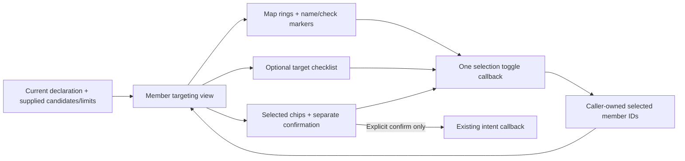

# Map-first member targeting — #1225

Authority: operator approved replacing the normal target window with map-first targeting, retaining an optional list, making selected creatures unmistakable, and using a separate confirmation control for **every multi-target action**, not a Bane special case. Re-clicking the armed multi-target icon does not confirm or erase choices. Baseline `6e3c19ef`. Existing favorites/status/notices remain; no live promotion or RPC changes.

## Inspected seams

TargetSurface currently owns map affordances and a permanent target/effects panel. CombatExperience passes its released/authority-gated state and map render props. SessionCombatMap uses SessionCanvas; SessionCanvas routes peer mesh/cell clicks through one handler but does not wire self mesh selection, and only draws peer availability rings. HexEntity owns the actual moving group, so target markers must attach there rather than to a second static position source. `Declaration.minTargets/maxTargets` are provider-authored ordered-list limits, not derived from spell names. Existing `selectCombatExperience` expands selected arrays only for CAST; the new generic presentation projection must not silently claim that existing live writers support arbitrary new multi-target verbs.

## Shape

## Task 17 — generic member selection model

**Owner/files:** new `src/components/session/combat-experience/memberTargeting.ts` and `.test.ts`.
**Inputs/outputs:** current Declaration or absent, raw selected IDs, authorityFresh and turnAllowed. Output exposes current available IDs, unique selected IDs, invalid selection/refusal, `multi` from MEMBER + maxTargets>1, and confirmation validity from supplied bounds. Toggle helper returns next IDs/changed/refusal; no effect execution.
**Behavior:** selected removal always allowed locally, including a withdrawn/unavailable selection. Adding requires a unique current available candidate, current available action and fresh/allowed authority; cannot exceed supplied max. Reject duplicate selected IDs, ambiguous/missing candidates and invalid bounds at confirmation. Keep invalid selections visible for removal, not silently substitute targets. Unknown/stale/unavailable action disables choice/confirmation with explanation. No spell-name or ally/enemy branching.
**Tests:** Bane and Bless equivalents, arbitrary names and a non-CAST member action with max3, toggle/deselect, bound refusal, minimum confirmation, zero supplied minimum, duplicate/withdrawn/unavailable rows, stale/turn refusal and safe removal. Source objects remain unchanged.

## Task 18 — map-first targeting surface and desktop composition

**Owner/files:** new `MapFirstTargeting.tsx`/`.module.css`/`.test.tsx`; modify TargetSurface.tsx, CombatExperience.tsx/module.css, ActionDock.tsx, types.ts and DesktopActionSurface.tsx/tests.
**Interfaces:** optional map-first presentation input on TargetSurface supplies the raw current declaration/selected IDs and authority facts separately from legacy selection projection. Add optional selectedTargets to CombatExperienceMapRenderProps. A CombatExperience-owned DOM host inside the desktop dock places the new surface above the bar through a portal, like the existing End Turn placement. No second targeting state store. Default/mobile keep existing TargetSurface behavior.
**Behavior:** compact strip shows action, supplied selection count, Targets toggle and Cancel. Multi-member actions add `Cast <name>` for CAST or `Confirm <name>` otherwise; only explicit confirmation calls onConfirmTargets. Selected name chips remove individuals. Targets opens a substantial checklist (or single-target buttons), not skinny always-open rows. Map/list/chips use the same guarded callback. Hover/focus previews a candidate name/refusal; detailed actor/target effect rows open only by an Info control and retain their distinct ownership/context. Cancel/Escape/switch clears through existing callbacks; re-clicking the same armed multi-member action leaves selection intact. Command variant/change-choice behavior retained. Cell/area targeting and reaction/death-save paths are not redesigned here.
**Tests:** no initial list/effects window, optional list, synchronized selected chips and map props, no confirmation on toggle/re-click, explicit enabled/disabled confirmation, stale/withdrawn selection visible but non-executable, read-only inspection, single-target callback parity and portal/default regression.
**UI lifecycle:** candidate inspection is keyed to action identity. Missing candidates close stale detail cards. Panels are bounded above the complete dock, not a clipped scroller; Log remains foreground. Confirmation and selection are separate callbacks. No tooltip infers damage/chance/range.

## Task 19 — selected map markers, including allies/self

**Owner/files:** new `src/components/hex-grid/EntityTargetMarker.tsx`/`.module.css`/tests; modify HexEntity.tsx and SessionCanvas.tsx/tests; wire SessionCombatMap.tsx.
**Interfaces:** optional selectedTargets on SessionCanvas enables member-targeting presentation; attackableTargets still owns available membership. Optional targetMarker on HexEntity contains selected/order display facts. An eligible marker includes a ring/name; selection adds a brighter ring and `✓ n`. Label clicks route through the same existing entity callback as mesh/cell clicks. Marker transforms live inside HexEntity's moving group, so they follow its rendered position.
**Behavior:** no markers or interaction changes without opt-in. Remembered/ghost entities never gain live markers or selectable mesh behavior. Newly opted-in targeting can select an offered self from mesh/label/own cell, necessary for Bless. Peer target mode uses offered membership rather than faction. A dead body may receive a marker/interaction only when explicitly offered; the renderer does not invent a resurrection restriction. On the new targeting path, remembered/unoffered clicks do not interact/walk instead. Eligible/selected rings are visually distinct; labels/checkmarks avoid color-only feedback. Marker geometry is not an extra raycast target. Existing camera/stance/self identity visuals remain.
**Tests:** R3F renderer confirms marker flags/order and handler routing for offered peer/self; unavailable and remembered rows excluded; legacy behavior retained. HexEntity test verifies marker in moving group and no remembered/ghost marker. Browser proof uses real anchored map label clicks, not stubbed list callbacks.

## Task 20 — shared-state concept wiring and walkthrough

**Owner/files:** OrganizedHudConcept.tsx and DesktopHotbarConcept.test.tsx; add concept targeting integration test as needed; update CONTRACT and issue1225. Local evidence in ignored `evidence/desktop-hotbar/map-targeting.mjs`/JSON/PNG.
**Behavior:** desktop opt-in uses the generic toggle helper. Single-target selections record the existing fixture intent without real execution. Multi-target toggles record selection only; explicit confirm records the current ordered IDs/name and clears local arming. Re-selecting the same multi-target icon preserves selection. Invalid references/authority cannot confirm. Bane uses supplied enemies; Bless uses supplied allies including self; same code, no per-spell behavior. Frame changes keep existing local choice ownership and the old compact layout. No changes to actual HP/map positions or network writes are claimed.
**Verification:** typecheck/changed-file lint/format; focused model/surface/shell/action/target/controller regressions; R3F SessionCanvas/HexEntity tests; native Chrome/SwiftShader map label clicks + checklist/chip toggles for Bane and Bless, explicit confirm, cap/deselect, cancel/re-click, visible selected checks, short-frame/panel bounds, default mobile and log/notice/favorites regressions. Inspect screenshots.

## Coverage

| Requirement                                 | Tasks    | Concrete proof                                                       |
| ------------------------------------------- | -------- | -------------------------------------------------------------------- |
| Map-first with optional list                | 18–20    | closed-on-arm list; actual map label clicks; no legacy target window |
| Selected creatures obvious                  | 19,20    | brighter ring + check/order labels and matching chips/screenshots    |
| Explicit multi-target confirmation, generic | 17,18,20 | Bane/Bless + arbitrary non-CAST helper/UI cases; no toggle dispatch  |
| Engine owns targets/limits                  | 17,18    | exact candidate/bounds, stale/invalid tests, no side/name inference  |
| Self/allies selectable                      | 19,20    | Bless self + Mira map interaction proof                              |
| Keep list/keyboard access and inspection    | 18,20    | checkbox/button controls, remove chips, Info without selecting       |
| Preserve existing callers/gates             | 18,19    | optional props, legacy + camera/knowledge/death-save regressions     |

## Provider/consumer check

| Producer                            | Consumer                               | Contract                                                               | Availability              | Proof                                  |
| ----------------------------------- | -------------------------------------- | ---------------------------------------------------------------------- | ------------------------- | -------------------------------------- |
| current declaration + selection IDs | generic model                          | provider membership/cardinality, local selected identity               | inspected existing fields | unit boundary cases                    |
| model                               | new targeting surface/map render props | available IDs + raw ordered selection, shared toggle, separate confirm | Task17 before18           | UI callbacks and list/chips assertions |
| TargetSurface render props          | SessionCombatMap → SessionCanvas       | optional selectedTargets; old callers omit                             | Task18/19                 | integration + native map clicks        |
| SessionCanvas                       | HexEntity/marker                       | offered live members only; selected/order/name; same click callback    | Task19                    | R3F and screenshots                    |
| desktop dock DOM host               | TargetSurface portal                   | placement only, no authority/state ownership moved                     | Task18                    | above-bar bounds and no lost callbacks |
| concept state                       | generic confirmation callback          | exact current selected IDs; no RPC/rules result                        | Task20                    | recorded intent only after confirm     |

Plan checks: no new transport/events/persistence/release pins. Generic presentation does not claim new live ACTIVATE multi-target RPC support; live promotion still needs the owning controller/provider integration. Source/target effects remain separate and context-named. The self-click gap is corrected only on the new targeting opt-in path. Marker attachment follows the existing movement owner rather than duplicating positions. Supplied min/max values are authoritative, including zero; invalid shapes refuse rather than guess. No unresolved architectural decision for the bounded concept.

## Completion evidence

- Tasks17–20 implemented for the isolated desktop concept. Typecheck/lint and348 focused tests pass, including the existing renderer/camera/knowledge/action/log regressions. The generic UI is tested with Bane, Bless, arbitrary spell names and a non-CAST member action with its own min/max; this does not claim new live RPC support.
- Chrome/SwiftShader `map-targeting.mjs` uses actual anchored map labels for enemy selection (Bane) and ally/self selection (Bless). Checks/order, list/chips, deselect/reselect, chip inspection and explicit confirmation match; re-clicking the armed icon neither confirms nor clears. Canvas identity is preserved through arming/confirmation. Single-target callback and on-demand effect inspection remain; no default target/effects window opens.
- Four-row popup bounds pass at1280×720 and1000×501. Native screenshots read after rendering. The first visual pass exposed duplicate Cancel controls, a retained action tooltip under the strip, white selected bodies and the old orange hover fill. Cancel now belongs to the strip (the toolbar keeps its callback for Edit); re-click clears its tooltip; measured targeting clearance keeps other hover cards above controls; rings/checks do not recolor models or duplicate the old hover fill. Chips split read-only name inspection from the explicit × removal.
- The DOM HUD commits ahead of the canvas root in some frames. The probe now awaits marker removal, and the harness uses a latest committed targeting snapshot so a delayed canvas callback cannot revive a cancelled/replaced action. A dedicated regression covers that callback race. Memoized participants keep snapshot dependencies stable.
- Source and target effect rows remain separate; picked-invalid identities stay visible/removable without allowing confirmation. Detailed panels are bounded and only opened deliberately. Compact/default paths are unchanged.
- Updated favorites and notice/history browser regressions also pass after the targeting change; choice labels use the new strip rather than the retired armed-window wording. No failures or page errors in the final walks.
- Local ignored evidence: `evidence/desktop-hotbar/map-targeting.json`, `map-targeting.mjs`, selected/list/inspection/short-frame screenshots. No browser page errors in completed walks. No assets, persistence, provider updates, full PR-boundary CI, independent review or live promotion are claimed.
