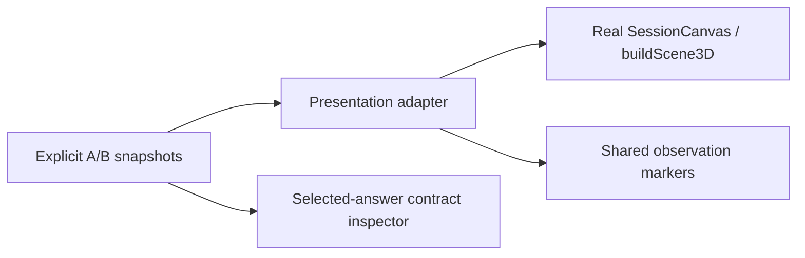

# Dungeon intel concept implementation plan

Approved in conversation by the operator: real game components, explicit permitted-view fixtures, outside-in contract discovery. Linked work: KirkDiggler/rpg-project#509, R&D #508.

## Checked scope and sequence

1. **Web / src/concepts/dungeon-intel:** typed generated atlas/sighting/door fixtures plus isolated provisional mutable-observation annotations. Closed-door start supplies only room 1. A observes room 2 while obstructed B does not; geometry persists after withdrawal, mutable testimony does not refresh unseen; re-observation replaces the disproved prop placement without a carrier/destination. Room 3 geometry/content never appear. Explicit snapshots replace each other; no LOS, discovery, event audience or memory rules run in web.
2. **Web / src/components/session and src/components/hex-grid/useCameraControls.ts:** a presentation-only marker layer labels supplied current/remembered prop and door observations at their supplied positions. An optional fit-request counter invokes the existing Home known-floor camera fit; omitted preserves production framing. Reuse real atlas prop/door meshes and existing creature remembered rendering, not creature-shaped prop fakes. No production session wiring or changes to gameplay rules.
3. **Web / src/concepts/ConceptsView.tsx:** register the concept. Controls select observer and storyboard snapshot, not game commands. Inspector exposes selected supplied answer only. Fixed scenery appearance is supplied by permitted atlas refs, never full GetDungeon/source content.
4. **Verification:** focused fixture/adapter tests inspect all atlas channels, scene inputs and observer isolation; component test mocks only WebGL boundary. Typecheck, focused lint/format, browser screenshots and console/network inspection verify real rendering. Complete ci-check once at a PR boundary, not after each edit. Independent review/publication is a separate gate; no automatic merge.

## Contract and dependency boundaries

Existing generated messages carry atlas construction, creature sightings and door values. Fixture annotations for prop/door current-vs-remembered testimony are provisional; neither final wire shape nor ordinary geometry discovery semantics are ratified. No proto/API/toolkit changes or dependency bumps. Promotion depends on upstream lawful observation, authorized delivery, persistence and revision-bound permitted appearance; merge provider-first after that wave exists.

The concept bundle contains future snapshots for developer step selection. No hidden complete-world map is filtered by the renderer. Initial selected scene input omits room 2; room 3 geometry is absent from all fixtures. This is UI/contract evidence only, not authenticated network non-disclosure, live replay/reconnect, RAW lighting or server persistence proof.
